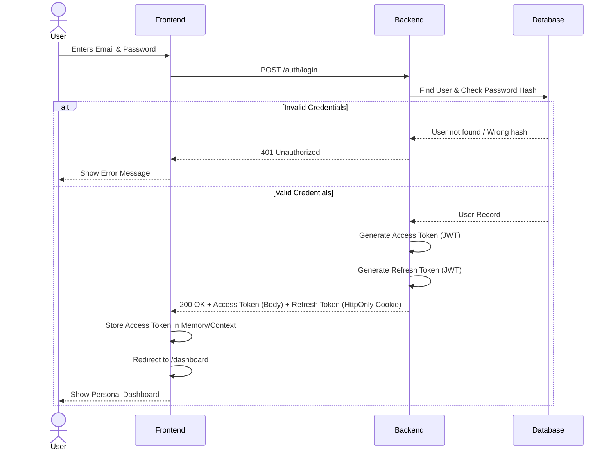
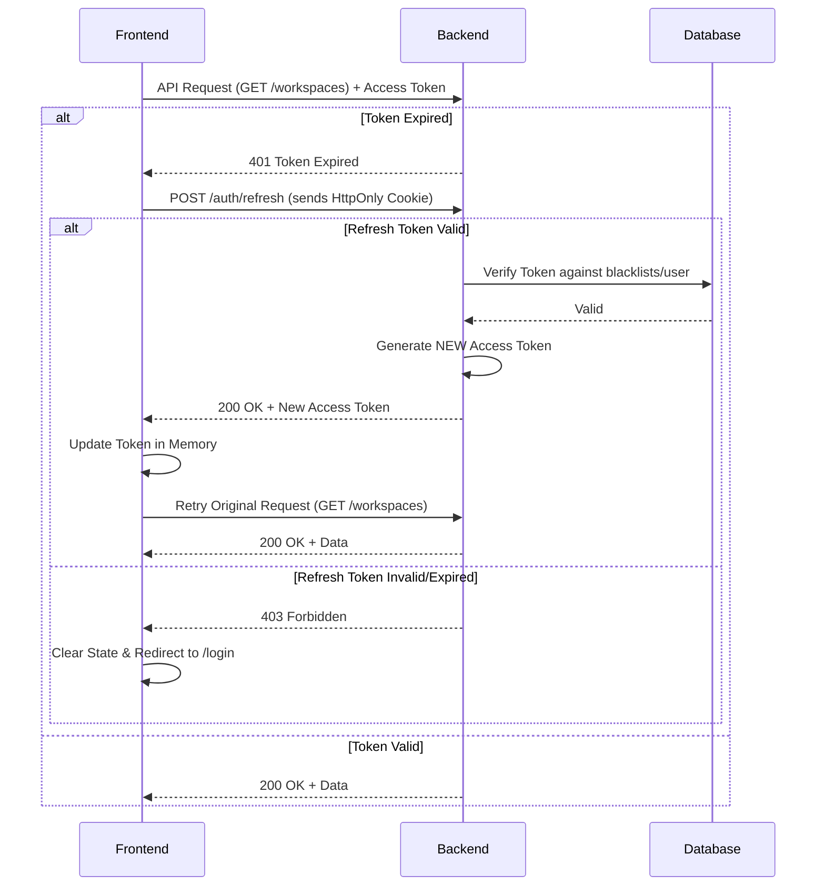
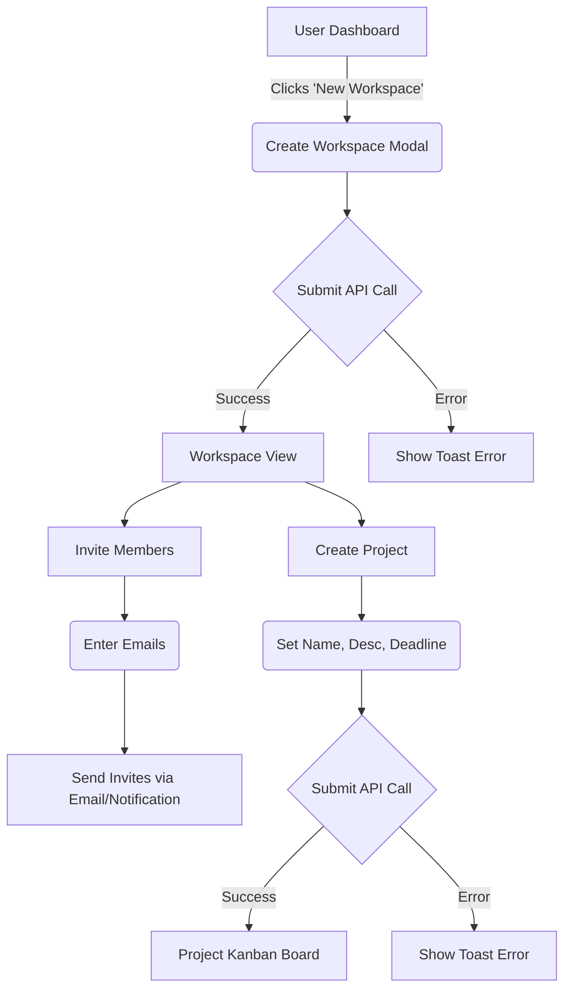
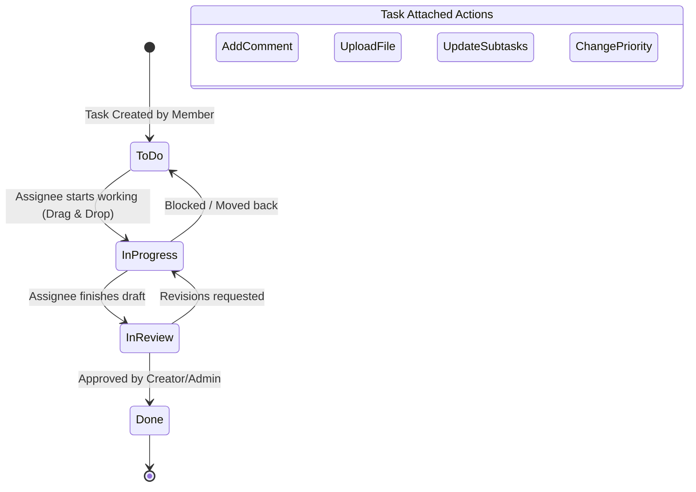

# 🛤️ Application Flow & User Journeys – System Design (Day 3)

> **CourseMea Hackathon 2026**  
> Focus: Visualizing how users navigate the platform and how data moves through the system.

---

## 1. Primary Authentication Flow

This diagram shows how a user enters the platform, gets authenticated via JWT, and lands on the dashboard.



---

## 2. Token Refresh Flow (Silent Auth)

Because access tokens expire quickly (e.g., 15 mins) for security, the frontend automatically requests a new one using the HttpOnly refresh token cookie.



---

## 3. Workspace & Project Creation Flow

The core journey for a Team Lead setting up the environment.



---

## 4. Task Lifecycle Flow

How a standard task moves through the system from creation to completion.



---

## 5. Screen Navigation Map

How the React frontend routes are connected.

```text
/ (Landing Page)
├── /login 
├── /register 
└── /dashboard (Protected)
    │
    ├── /profile                  (User settings & pwd change)
    │
    ├── /workspaces/:id           (Workspace Overview & Members)
    │   ├── /settings             (Admin only)
    │   └── /projects             (List of projects)
    │       └── /:projectId       (Kanban Board View)
    │           └── /tasks/:taskId (Task Modal/Detail Panel)
    │
    └── /analytics                (Platform-wide charts)
```

---

## 6. Real-time / Polling Strategy

Since WebSocket (Socket.io) is out of scope for this 15-day hackathon, we will simulate real-time collaboration using a strategic polling approach in specific views:

1. **Kanban Board (`/projects/:projectId`)**: Poll `GET /tasks` every 30 seconds to catch status changes made by teammates.
2. **Task Modal (`/tasks/:taskId`)**: Poll `GET /comments` every 15 seconds while the modal is open to simulate live chat.
3. **Dashboard**: Trigger fetch only on mount (no polling needed).
4. **Activity Feed**: Trigger fetch on mount, push local actions optimistically to the top of the list.
