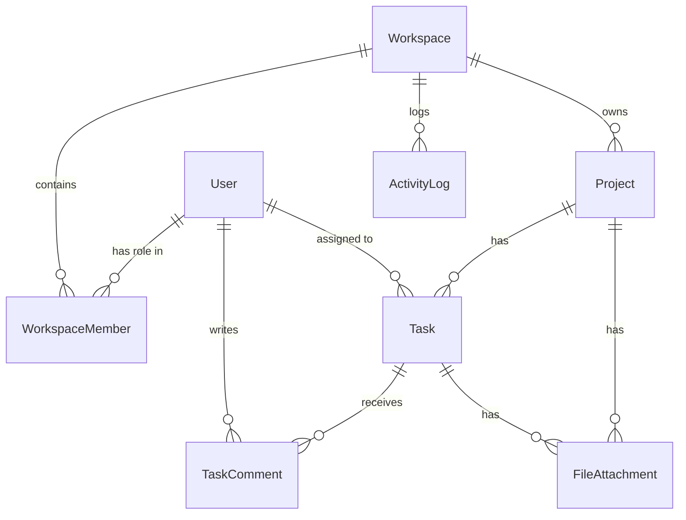

# 🗄️ Database Schema – System Design (Day 3)

> **CourseMea Hackathon 2026**  
> Database: **MongoDB**  
> ODM: **Mongoose**

This document defines the structure of our MongoDB collections, focusing on associations and the data required to power the feature list.

---

## ER Diagram (Entity Relationship)



---

## 1. User Collection
**Purpose:** Stores user authentication and profile data.

```typescript
const userSchema = new Schema({
  name: { type: String, required: true },
  email: { type: String, required: true, unique: true },
  password: { type: String, required: true }, // bcrypt hashed
  avatarUrl: { type: String, default: "" },
  bio: { type: String, default: "" },
  refreshToken: { type: String, default: "" },
}, { timestamps: true });
```

---

## 2. Workspace Collection
**Purpose:** Represents a team's isolated environment. Projects and tasks live inside a workspace.

```typescript
const workspaceSchema = new Schema({
  name: { type: String, required: true },
  description: { type: String, default: "" },
  logoUrl: { type: String, default: "" },
  ownerId: { type: Schema.Types.ObjectId, ref: 'User', required: true },
  inviteToken: { type: String }, // For shareable invite links
}, { timestamps: true });
```

---

## 3. WorkspaceMember Collection
**Purpose:** Junction collection linking Users to Workspaces with their specific role.

```typescript
const workspaceMemberSchema = new Schema({
  workspaceId: { type: Schema.Types.ObjectId, ref: 'Workspace', required: true },
  userId: { type: Schema.Types.ObjectId, ref: 'User', required: true },
  role: { 
    type: String, 
    enum: ['Admin', 'Member', 'Guest'], 
    default: 'Member' 
  },
  joinedAt: { type: Date, default: Date.now }
}, { timestamps: true });
```
*(Constraint: Compound unique index on `[workspaceId, userId]`)*

---

## 4. Project Collection
**Purpose:** Logical grouping of tasks within a workspace.

```typescript
const projectSchema = new Schema({
  workspaceId: { type: Schema.Types.ObjectId, ref: 'Workspace', required: true },
  name: { type: String, required: true },
  description: { type: String, default: "" },
  status: { 
    type: String, 
    enum: ['Active', 'On Hold', 'Completed', 'Archived'], 
    default: 'Active' 
  },
  deadline: { type: Date },
  members: [{ type: Schema.Types.ObjectId, ref: 'User' }], // Users assigned to project
}, { timestamps: true });
```

---

## 5. Task Collection
**Purpose:** The core unit of work. Belongs to a project.

```typescript
const taskSchema = new Schema({
  projectId: { type: Schema.Types.ObjectId, ref: 'Project', required: true },
  workspaceId: { type: Schema.Types.ObjectId, ref: 'Workspace', required: true },
  title: { type: String, required: true },
  description: { type: String, default: "" },
  status: { 
    type: String, 
    enum: ['To Do', 'In Progress', 'In Review', 'Done'], 
    default: 'To Do' 
  },
  priority: { 
    type: String, 
    enum: ['Low', 'Medium', 'High', 'Critical'], 
    default: 'Medium' 
  },
  dueDate: { type: Date },
  assigneeId: { type: Schema.Types.ObjectId, ref: 'User' },
  creatorId: { type: Schema.Types.ObjectId, ref: 'User', required: true },
  
  // Embedded Sub-tasks
  subTasks: [{
    title: { type: String, required: true },
    isCompleted: { type: Boolean, default: false }
  }]
}, { timestamps: true });
```
*(Note: `workspaceId` is duplicated here for easier filtering and analytics queries).*

---

## 6. TaskComment Collection
**Purpose:** Discussion thread on a specific task.

```typescript
const taskCommentSchema = new Schema({
  taskId: { type: Schema.Types.ObjectId, ref: 'Task', required: true },
  authorId: { type: Schema.Types.ObjectId, ref: 'User', required: true },
  content: { type: String, required: true },
}, { timestamps: true });
```

---

## 7. FileAttachment Collection
**Purpose:** Metadata for files uploaded to a task or project.

```typescript
const fileAttachmentSchema = new Schema({
  workspaceId: { type: Schema.Types.ObjectId, ref: 'Workspace', required: true },
  uploaderId: { type: Schema.Types.ObjectId, ref: 'User', required: true },
  // Can be attached to a Task or a Project
  targetId: { type: Schema.Types.ObjectId, required: true }, 
  targetModel: { type: String, enum: ['Task', 'Project'], required: true },
  
  fileName: { type: String, required: true },
  fileUrl: { type: String, required: true }, // Local path or Cloudinary URL
  fileSize: { type: Number, required: true }, // In bytes
  fileType: { type: String, required: true }, // e.g., 'application/pdf', 'image/png'
}, { timestamps: true });
```

---

## 8. ActivityLog Collection
**Purpose:** Audit trail for the workspace history and analytics.

```typescript
const activityLogSchema = new Schema({
  workspaceId: { type: Schema.Types.ObjectId, ref: 'Workspace', required: true },
  projectId: { type: Schema.Types.ObjectId, ref: 'Project' }, // Optional
  taskId: { type: Schema.Types.ObjectId, ref: 'Task' },       // Optional
  userId: { type: Schema.Types.ObjectId, ref: 'User', required: true },
  
  action: { type: String, required: true }, 
  // e.g., "CREATED_TASK", "CHANGED_STATUS", "UPLOADED_FILE"
  
  details: { type: String, required: true }, 
  // e.g., "Moved task to In Progress", "Created workspace"
}, { timestamps: true });
```

---

## Indexing Strategy
To ensure performance on the dashboard and main views, we will add indices to:
1. `User.email` (Unique)
2. `WorkspaceMember.workspaceId` + `WorkspaceMember.userId` (Compound Unique)
3. `Task.projectId` (For loading board view)
4. `Task.assigneeId` + `Task.status` (For personal dashboard filtering)
5. `ActivityLog.workspaceId` + `ActivityLog.createdAt` (For chronological activity feed)
